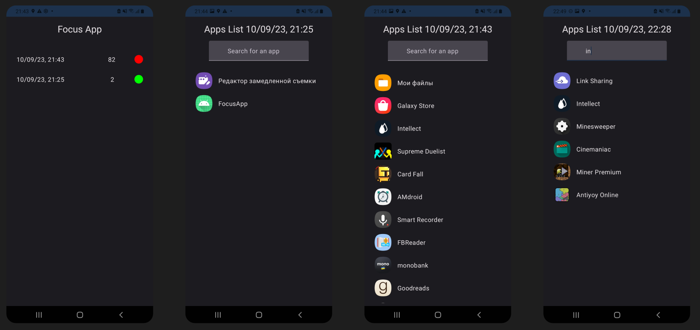

### About

Focus App periodically gather the installed apps even when the app is closed.
List of the installed apps called `statuses` ([FocusStatusDetails]).
Statuses are stored in the local database and can be shown.
Currently there is no way to stop gathering - only uninstall the Focus App itself.

### Used technologies

* Gathering is happening with the help of `WorkManager` by [StatusGathererWorker].
* Data is backed up by `Room` database.
* UI and navigation are written in `Compose`.
* Dependency injection by Hilt.
* Centralization of versions backed by `Versions catalog`.
* For multithreading `Coroutines` and `Flow`.
* Language is `Kotlin`.

### List of modules

Some of the modules contains their own README files with more details, still consider this one as a
quick overview for a better navigation.

* app - gather application together by providing navigation between features;
* feature:status - currently the only one feature of the app to show list of statuses and status
  details;
* core:model - pure kotlin module that contains core data types that app can operate with;
* core:data - all data is provided via this module, it contains repositories both interface and
  implementation;
* core:network, core:database - provides data sources for `core:data`;
* core:status-gatherer - provides periodic worker to gather the statuses;
* core:designsystem - contains app Theme and related;
* core:ui - shared UI components and side-effects;
* core:domain - regular android's domain layer, contains UseCases;
* core:common - miscellaneous stuff that shared across modules;
* core:testing - rules, testing data providers;
* build-logic - plugins for gradle files to make them shorter and nicer.

### Currently not implemented, but reserved place for

* Tests - all implementation are separated by interface for nice integration of `fake` and `sample`
  implementations.
* FileProvider - to store icons of the installed apps.
* DataStore - to store id of the running request to be able to stop/restart gathering, as well as
  other simple settings.

### Inspired by

I've been investigating the `NowInAndroid app` for the last couple of weeks, so decided to apply
its structure to this project.
